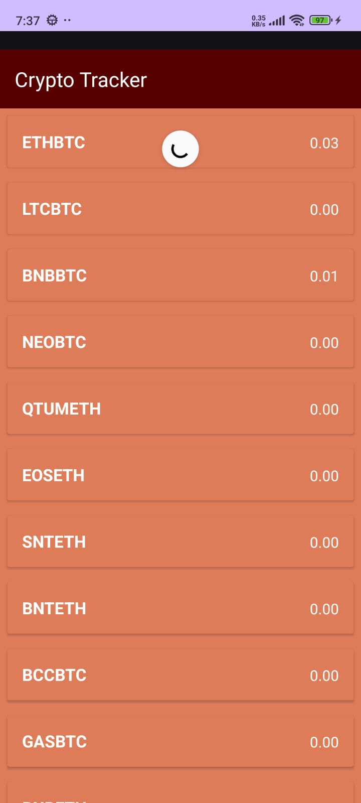

# CryptoTracker - Android App (Kotlin)

CryptoTracker is a real-time cryptocurrency tracking Android app built with Kotlin and Android Studio.  
It uses the Binance API to fetch live data and display prices in a clean, responsive UI.

## 📱 Features

- Live crypto price updates using Retrofit or WebSocket
- Beautiful RecyclerView list of coins
- Uses Glide for image loading
- Material UI design with responsive layout
- Lightweight and fast

## 🔧 Tech Stack

- Kotlin
- Android Studio
- Retrofit / OkHttp / WebSocket
- Glide
- RecyclerView

## 📸 Screenshots

